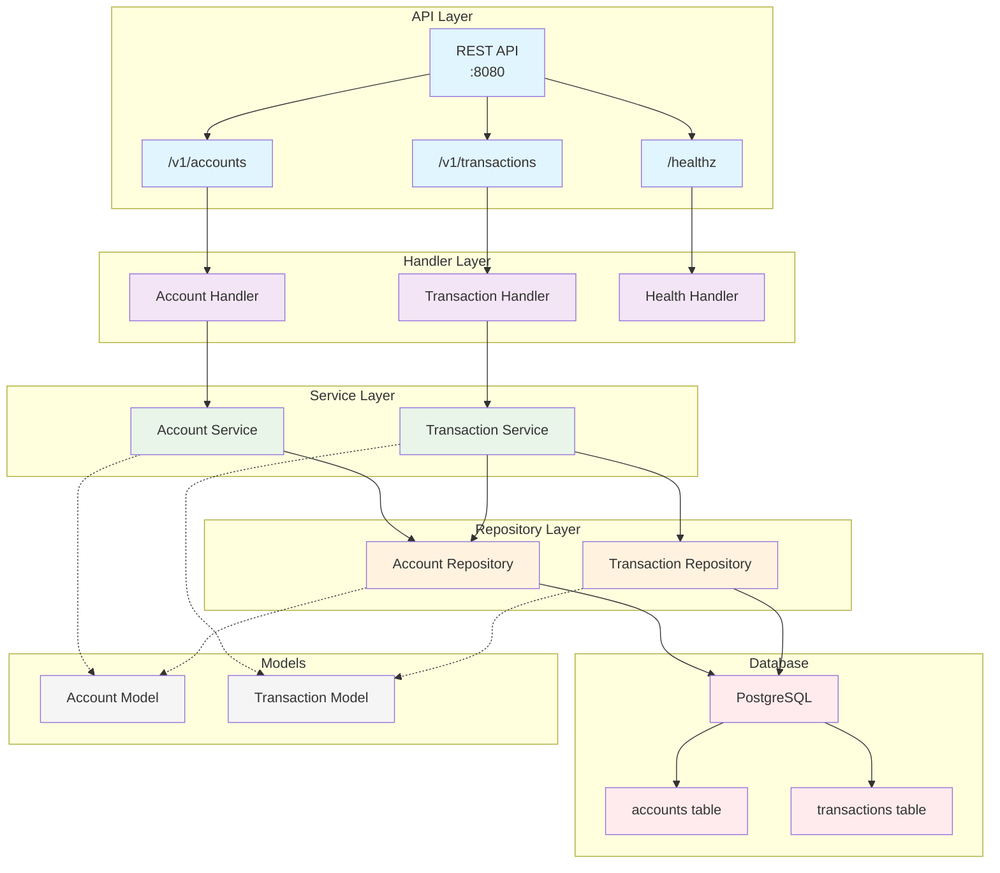
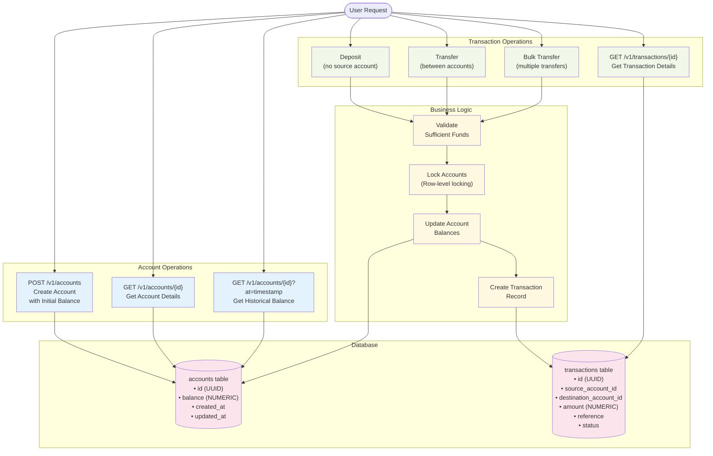

# Internal Transfers API

A Go microservice for handling internal money transfers with PostgreSQL.

## What it does

- Account management with balance tracking
- Money transfers between accounts  
- Bulk transfer processing
- Basic health checks and error handling
- ACID transaction guarantees

## Getting started

```bash
# Start the services
make dev

# API runs on http://localhost:8080
# Health check: http://localhost:8080/healthz

# Stop the services
make docker-down
```

## API Reference

### Available Endpoints

| Method | Path | Purpose |
|--------|------|---------|
| GET | `/healthz` | Health check |
| POST | `/v1/accounts` | Create account |
| GET | `/v1/accounts/{id}` | Get account details |
| GET | `/v1/accounts/{id}?at=timestamp` | Get historical balance |
| POST | `/v1/transactions` | Create transaction/transfer |
| GET | `/v1/transactions/{id}` | Get transaction details |
| GET | `/v1/accounts/{id}/transactions` | Get account transactions |

### Step-by-Step Testing

#### 1. Health Check
```bash
curl http://localhost:8080/healthz
```
**Expected response:**
```json
{
  "status": "healthy",
  "timestamp": "2025-06-29T16:45:53.870971835Z",
  "version": "1.0.0",
  "database": {
    "status": "healthy",
    "migration_version": "001",
    "connection_pool": "open: 1, idle: 1, in_use: 0"
  }
}
```

#### 2. Create Accounts
```bash
# Create first account with initial balance
curl -X POST http://localhost:8080/v1/accounts \
  -H "Content-Type: application/json" \
  -d '{"initial_balance": "1000.00"}'

# Create second account with initial balance
curl -X POST http://localhost:8080/v1/accounts \
  -H "Content-Type: application/json" \
  -d '{"initial_balance": "500.00"}'
```
**Expected response:**
```json
{"id":"363686ca-7c2d-4ce3-a0d4-d904d25637ad","balance":"1000"}
```

#### 3. Make a Deposit (no source account)
```bash
curl -X POST http://localhost:8080/v1/transactions \
  -H "Content-Type: application/json" \
  -d '{
    "destination_account_id": "363686ca-7c2d-4ce3-a0d4-d904d25637ad",
    "amount": "100.00"
  }'
```
**Expected response:**
```json
{
  "id": "2235a24b-3f70-46a3-9776-29747cdbabba",
  "source_account_id": null,
  "destination_account_id": "363686ca-7c2d-4ce3-a0d4-d904d25637ad",
  "amount": "100",
  "status": "completed",
  "created_at": "2025-06-29T16:42:39.486427Z"
}
```

#### 4. Transfer Between Accounts
```bash
curl -X POST http://localhost:8080/v1/transactions \
  -H "Content-Type: application/json" \
  -d '{
    "source_account_id": "363686ca-7c2d-4ce3-a0d4-d904d25637ad",
    "destination_account_id": "82847968-ee5d-4b99-87d6-53264ec13be1",
    "amount": "25.50",
    "reference": "monthly-payment"
  }'
```

#### 5. Check Account Balance
```bash
curl http://localhost:8080/v1/accounts/363686ca-7c2d-4ce3-a0d4-d904d25637ad
```
**Expected response:**
```json
{
  "id": "363686ca-7c2d-4ce3-a0d4-d904d25637ad",
  "balance": "74.5",
  "created_at": "2025-06-29T16:42:31.863524Z",
  "updated_at": "2025-06-29T16:42:42.624179Z"
}
```

### Bulk Transfers
```bash
curl -X POST http://localhost:8080/v1/transactions \
  -H "Content-Type: application/json" \
  -d '{
    "transfers": [
      {
        "source_account_id": "363686ca-7c2d-4ce3-a0d4-d904d25637ad",
        "destination_account_id": "82847968-ee5d-4b99-87d6-53264ec13be1",
        "amount": "10.00"
      },
      {
        "source_account_id": "363686ca-7c2d-4ce3-a0d4-d904d25637ad",
        "destination_account_id": "82847968-ee5d-4b99-87d6-53264ec13be1",
        "amount": "15.00"
      }
    ]
  }'
```

### Error Responses

**Insufficient funds:**
```json
{"error":"Insufficient funds in source account","code":"INSUFFICIENT_FUNDS"}
```

**Account not found:**
```json
{"error":"Account not found","code":"NOT_FOUND"}
```

**Invalid JSON:**
```json
{"error":"Invalid JSON","code":"INVALID_INPUT"}
```

## Development

Requires Go 1.21+ and Docker.

```bash
make dev              # Start local environment
make test             # Run tests
make test-integration # Integration tests only
make build            # Build binary
```

### Environment variables

**Required for docker-compose:**
```bash
POSTGRES_DB=your_database_name
POSTGRES_USER=your_database_user
POSTGRES_PASSWORD=your_secure_password
```

**Optional application settings:**
```bash
PORT=8080
DB_HOST=localhost
DB_PORT=5432
LOG_LEVEL=info
LOG_FORMAT=json
```

## Database schema

```sql
CREATE TABLE accounts (
    id UUID PRIMARY KEY DEFAULT gen_random_uuid(),
    balance NUMERIC(38,10) NOT NULL DEFAULT 0,
    created_at TIMESTAMP DEFAULT NOW(),
    updated_at TIMESTAMP DEFAULT NOW(),
    CONSTRAINT positive_balance CHECK (balance >= 0)
);

CREATE TABLE transactions (
    id UUID PRIMARY KEY DEFAULT gen_random_uuid(),
    source_account_id UUID REFERENCES accounts(id),
    destination_account_id UUID NOT NULL REFERENCES accounts(id),
    amount NUMERIC(38,10) NOT NULL,
    reference VARCHAR(255),
    status VARCHAR(20) NOT NULL DEFAULT 'pending',
    created_at TIMESTAMP DEFAULT NOW(),
    completed_at TIMESTAMP,
    CONSTRAINT positive_amount CHECK (amount > 0)
);
```

### System Architecture



### Business Flow



## Docker

```bash
docker compose up --build
```

The service connects to PostgreSQL and runs migrations automatically.

## Testing

```bash
# All tests
make test

# Just unit tests  
make test-unit

# Performance tests
make perf
```

Tests cover business logic, database operations, and concurrent access scenarios.